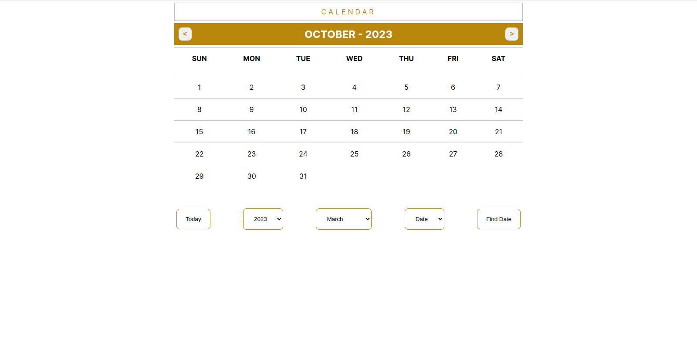

# Angular Task 2: Calendar

### Task: 

#### Version 1:
- The Left and right Arrow buttons allow the user to move next and previous month.
- The Title will display the current month and year.
- Highlight today’s date.
- Today Button: This button take user at today’s date from anywhere.
- Disable all other buttons & dropdown in version 1

#### Version 2:
- Users can set any date and pressing on find date button will take the user on that day
- If the user sets only year and month then that month will open but the date will not highlight.
- The first select box will give 1970 to 2070 options to select a year.
  + Default selected Year - Current Year
- The second select box will give 12 months as a select option.
  + Default selected Month - current month
- Based on the first two select boxes, a date will give options of date 1 to 31 or 30 or 29 or 28 according to month and year.
  + Default selected Date - None 

### Preview:

