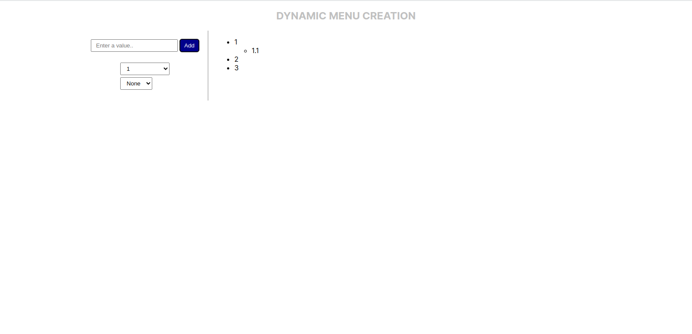
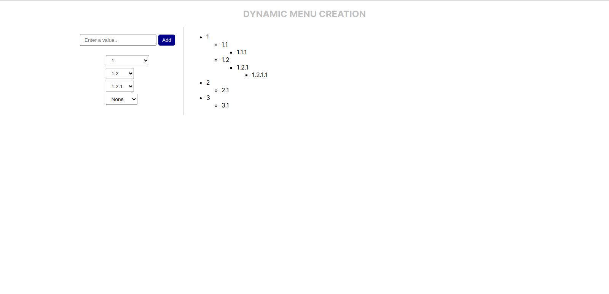

# Angular Task : Dynamic Menu Creation

### Task:
- Create one Text box and submit button initially.
- A User can add a list item as a parent or as child of any parent item at any number of levels.

### Preview:

