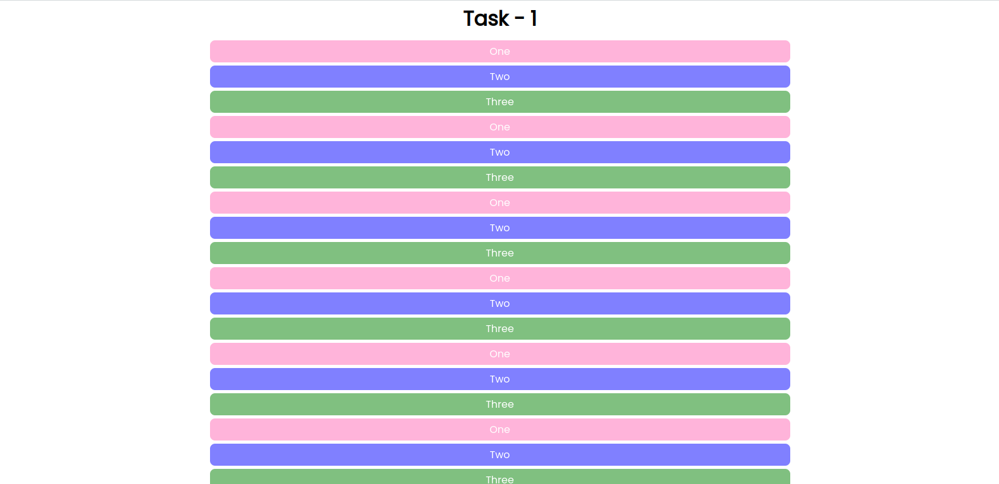
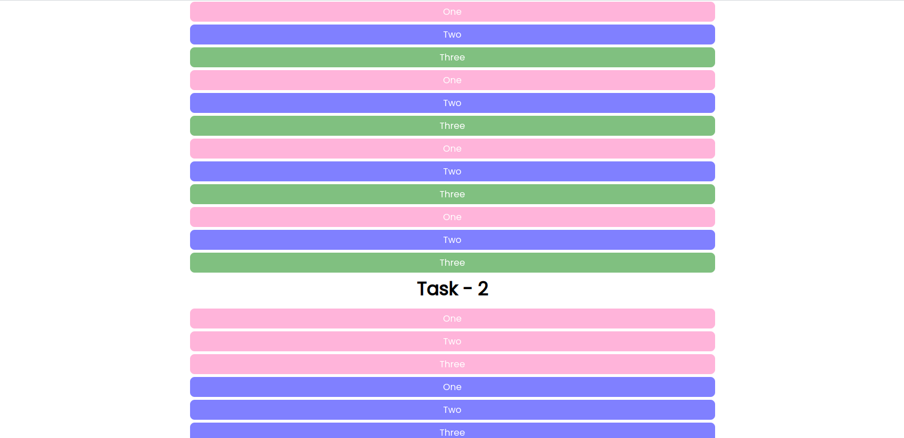
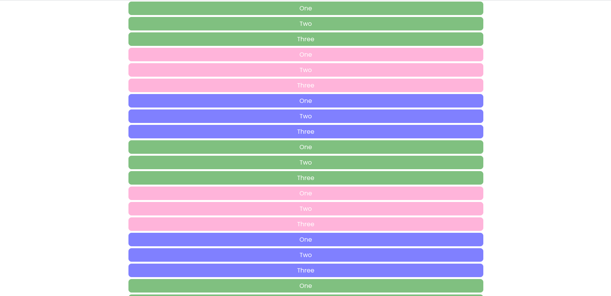

# Design Task 4: CSS Advance Concepts

#### Task :

- Read about CSS combinators, pseudo-class , pseudo-element and note down the doubts.
- When done with reading start working on pseudo element task.

- Pseudo element task:
Create following design using above concepts and list items

#### Preview

