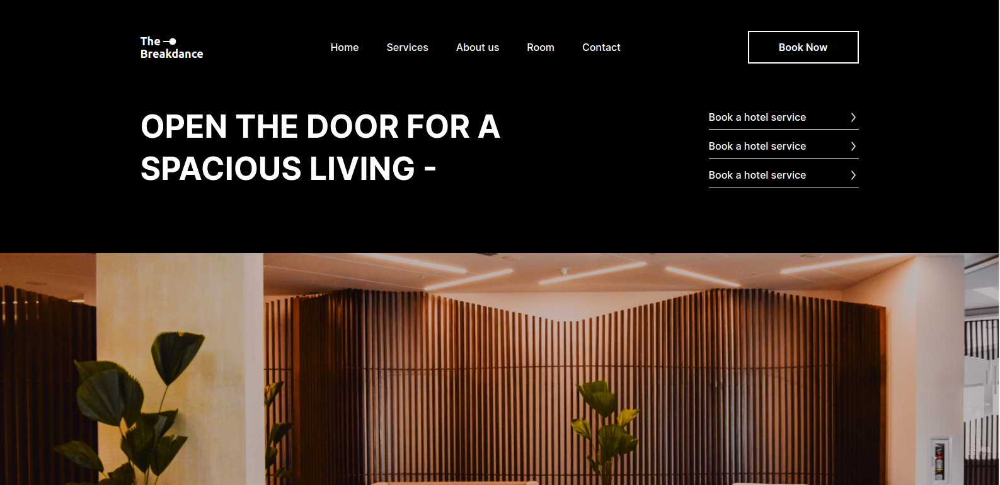
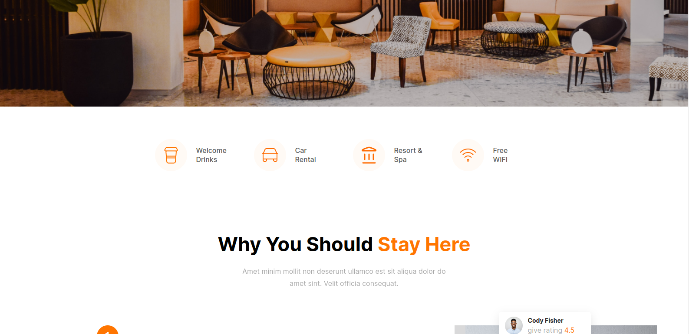
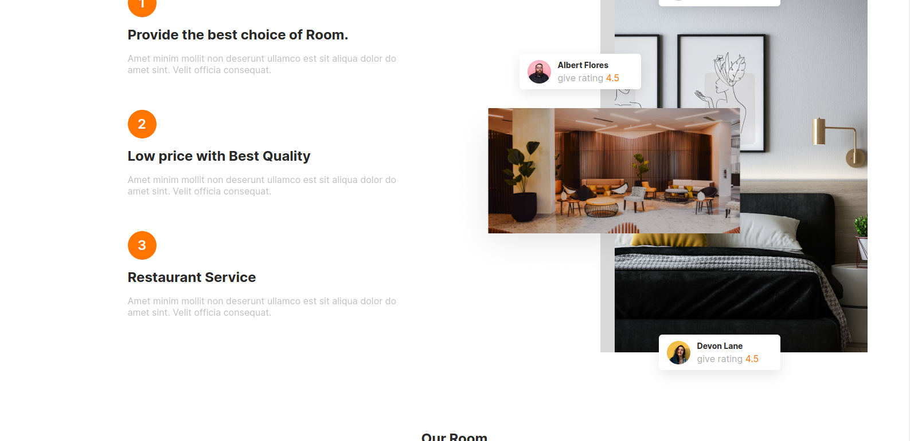
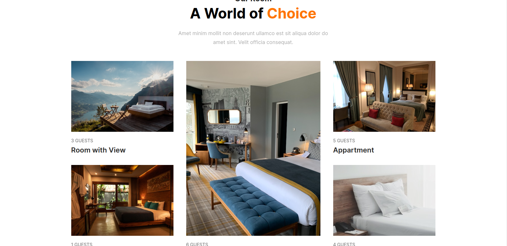
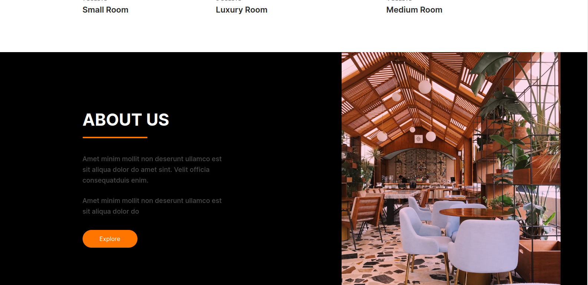
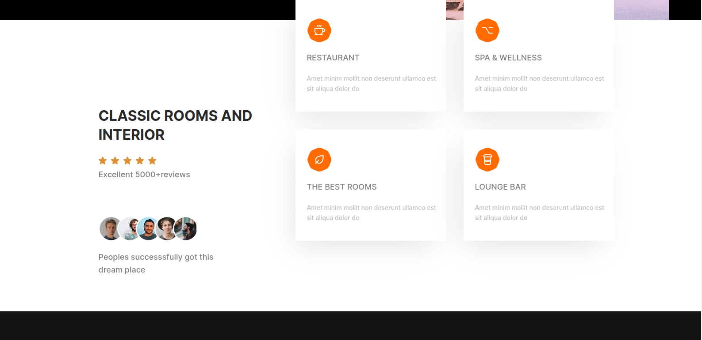
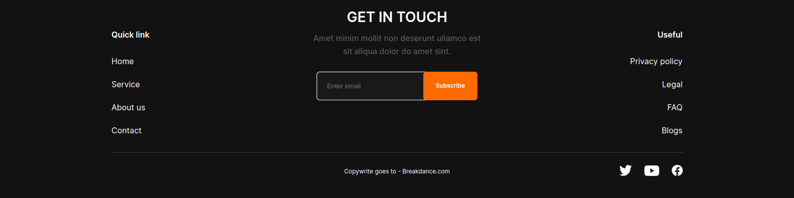

# Design Task 5: Hotel Landing Page

#### Task: Create Responsive Design From Following [Figma File](https://www.figma.com/file/XBylX2hqitxEhQFdtinedw/Hotel-Landing-Page-(Community)-(Copy)?node-id=1%3A286&t=niPUmUZz5HdyN3uK-0).
Sections:
1. Nav Bar
2. Main Image
3. Why you should stay here
4. A world of choice
5. About US
6. Classic rooms and interior
7. Get In Touch
8. Footer

#### Preview

