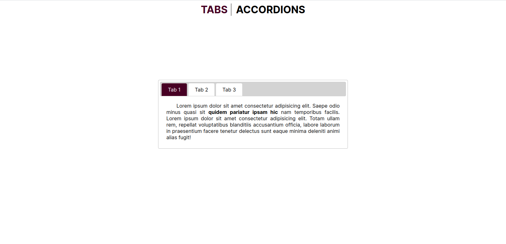
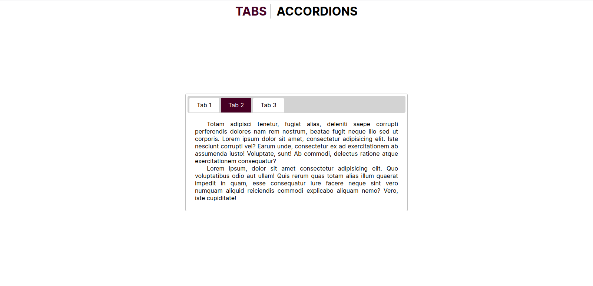
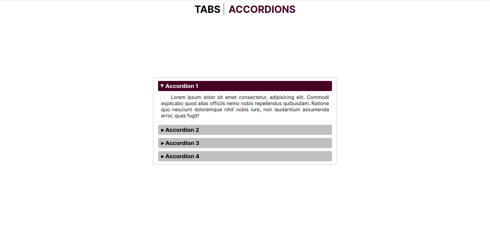
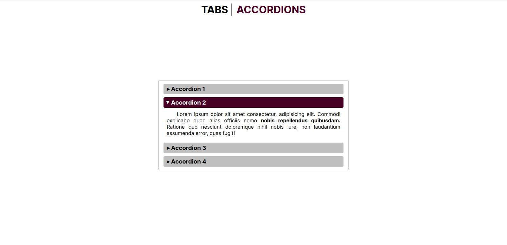
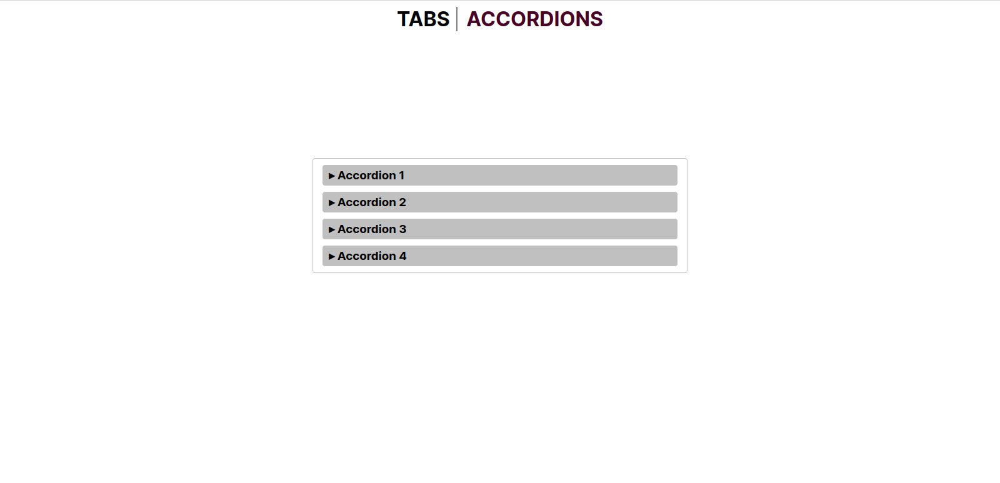

# JQuery Task 2: Tab & Accordion

### Task:
#### 2.1 Tab:
- Develop a webpage containing three tabs with text.
#### 2.2 Accordion:
- Develop a webpage containing four Accordion sections with text.
- By default, accordions always keep one section open.
- Click on the currently open section to collapse its content pane.

### Preview

