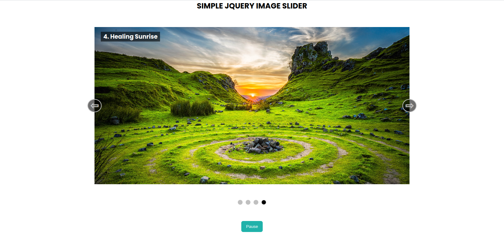

# JQuery Task 3: IMAGE SLIDER

#### Task:
- Develop a slider with 4 slides.
- Each slide contains one image and a title.
- Add two arrows (Next and Previous) to change slides.
- Add proper animation.
- Add four clickable dots at the bottom to jump on any slide.
- Add the play and pause buttons to start and stop automatic sliding.
- By default, automatic sliding is ON.

#### Preview

