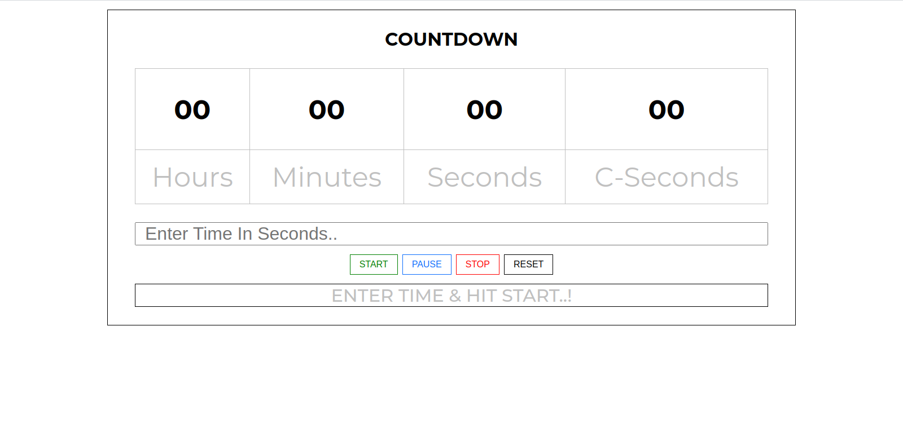
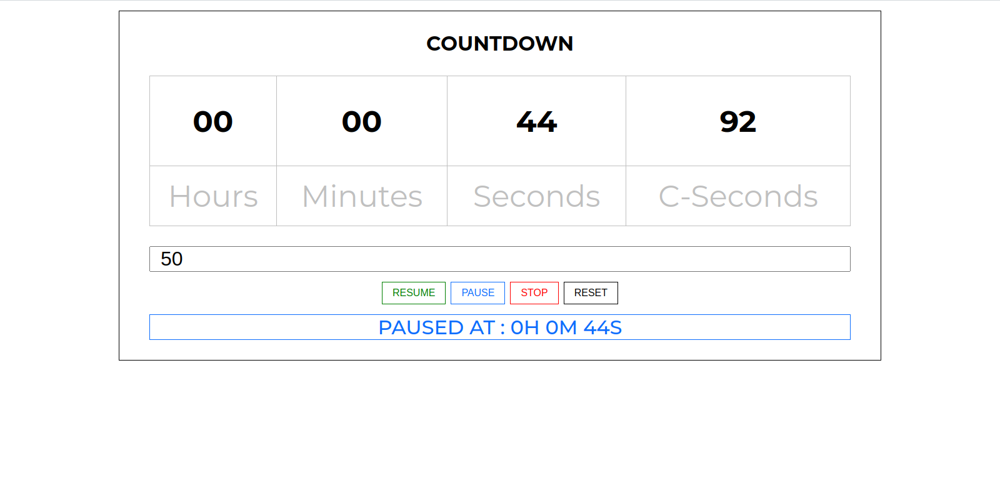
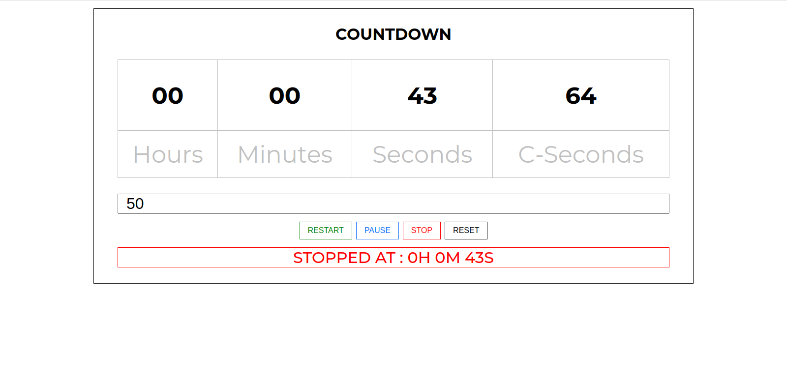
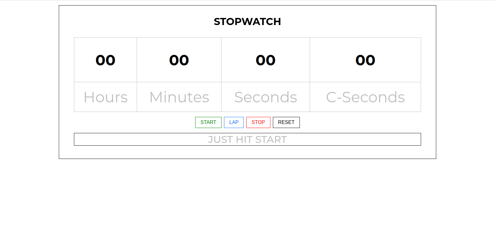
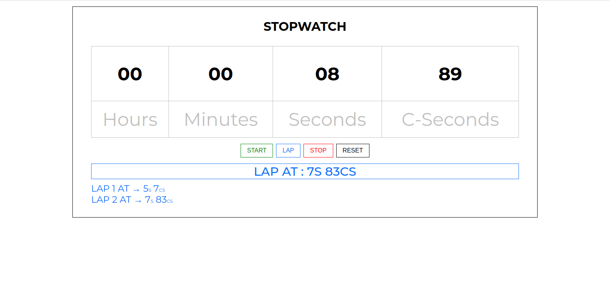
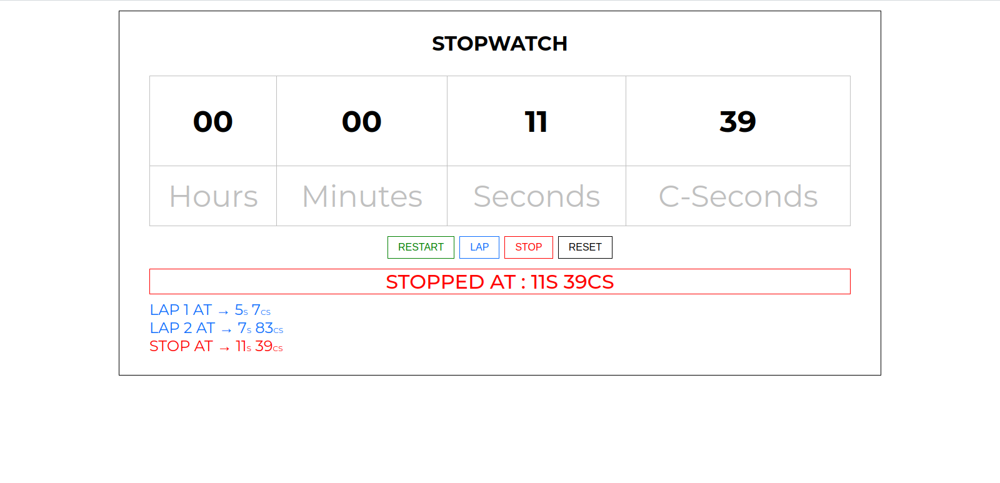

# JQuery Task 4 : Countdown & Stopwatch

### Task:

#### 4.1: Countdown [Take Me There](Countdown/)

- Enter time in seconds and press the start button, the timer will start in decreasing manner.

##### Example: For 60:

- It will start from 00:00:59:99 to 00:00:00:00 :white_check_mark:
- The “Pause button” will pause the timer and convert the “Start button” into the “Resume button”.
- The “Resume button” will start the timer from the remaining time.
- The “Stop button” will stop the timer and convert the “Start button” into the “Restart button”.
- The “Restart button” will start the timer again from the beginning.
- Reset at any stage will set the timer position to 00:00:00:00 and convert the “Resume/Restart button” into the “Start button”.
- Display a log of the latest activity at the bottom with different colors.

#### 4.2 : Stopwatch [Take Me There](Stopwatch/)

- It Will Start From 00:00:00:00.
- "Lap" button will take timestamp and add It In Log.
- "Stop" button will take timestamp and Stops Timer.
- "Reset" button will clear logs and sets timer to 00:00:00:00.

### Preview

#### Countdown

#### Stopwatch

