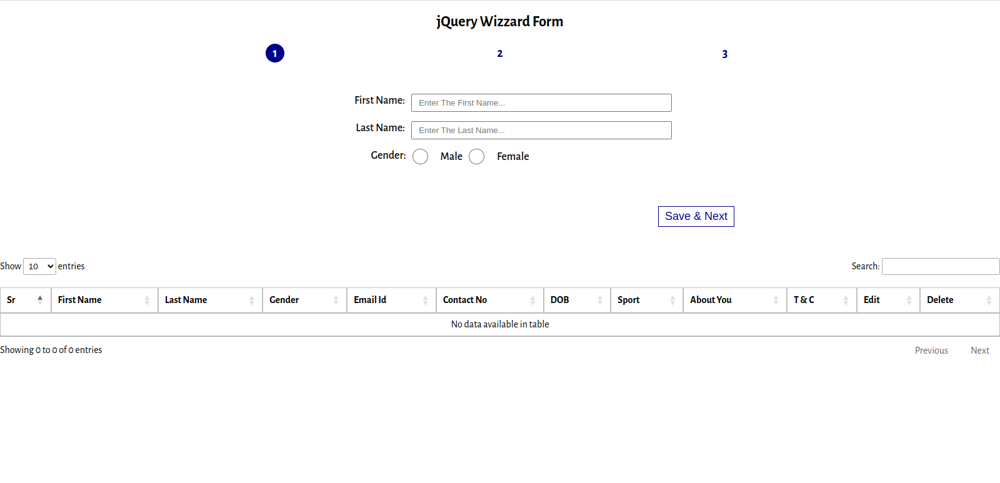
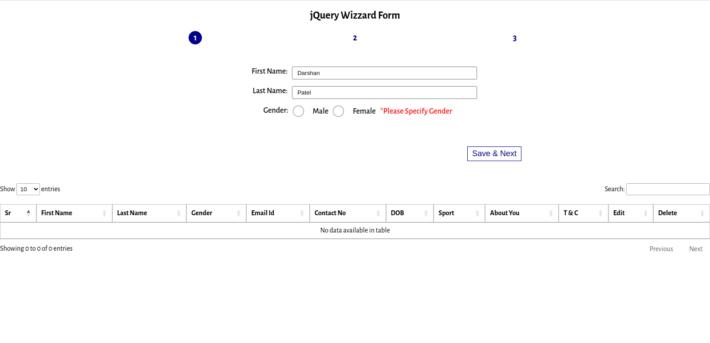
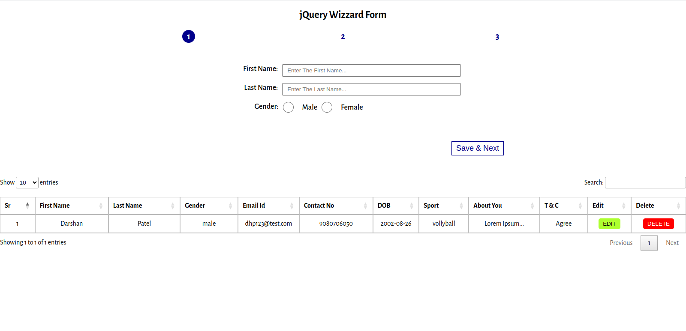
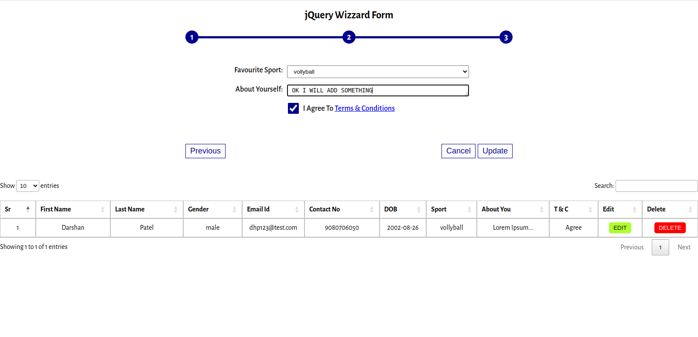
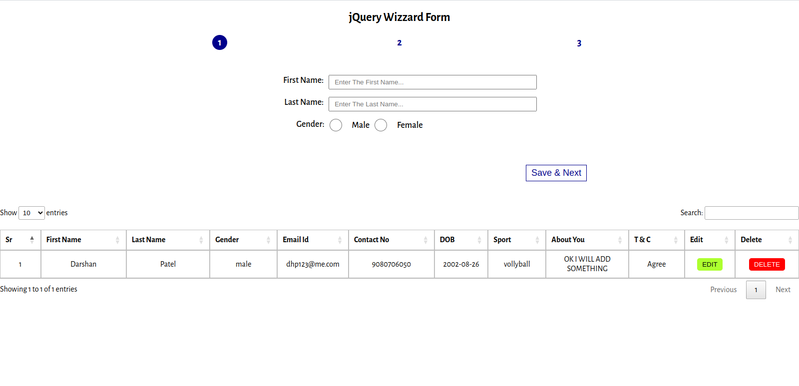

# JQuery Task 5: Wizard Form

### Task:

#### 5.1: 3 Step Form With HTML Table
- Create a wizard form that contains three levels.
- Level 1: First name, last name & Gender(Radio)
- Level 2: Email Id, Contact number & Date of birth
- Level 3: Favourite sports(select), About you (Textarea) & T&C (Checkbox)
- Add “Previous” and “Next” button in each level
- In the Last level add “Submit” button instead of “Next” button.
- Create an empty HTML table at bottom of the page with 11 fields. (9 same as form field + 1 field for edit button + 1 field for delete button)
- When the user hits the submit button, all data will append to the table and reset the form. You can add any number of fields to the table.
- When the user hits any EDIT button,
  - Load all values of that row to form,
  - Convert submit button into the update button,
  - and Add the cancel button at the third level.
- Click on the cancel button will clear the form and do not change the table.
- Click on the update button will update the value in the table.
- Click on the delete button will remove that row from the table.

#### 5.2: ADD JQuery DataTable Plugin

- Add JQuery DataTable Plugin Instead of HTML Table

#### 5.3: ADD Validations Plugin
- Add validations in all fields with custom message.
- Validations should looks like:
  - Should not empty.
  - Minimum and maximum character limit.
  - Few special character allowed, few not allowed.
  - Special validations like, email, phone, date.
  - Birthdate must be previous, applicant age should be between 18 to 60 years.

### Preview:

